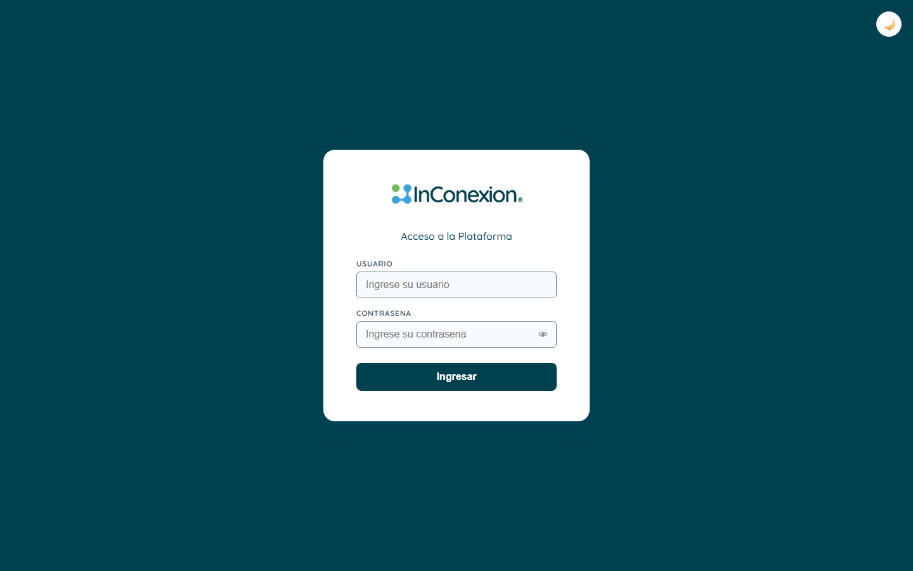
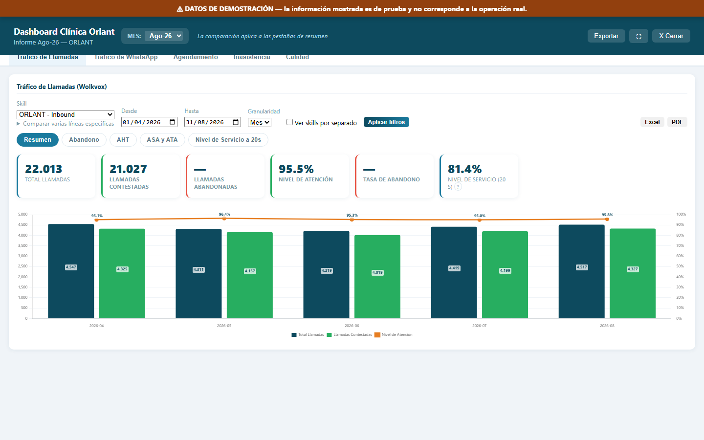
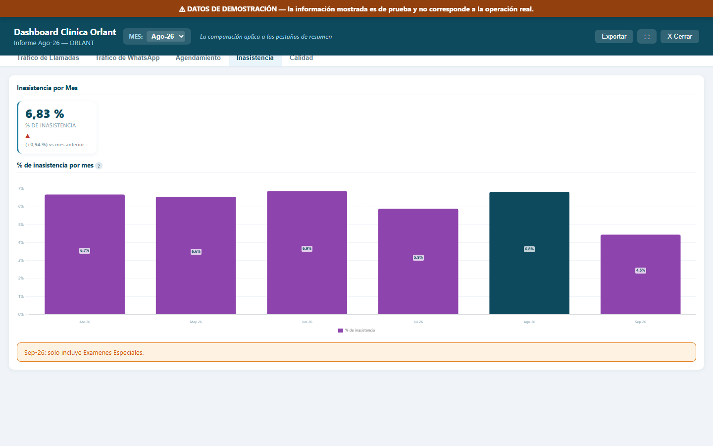
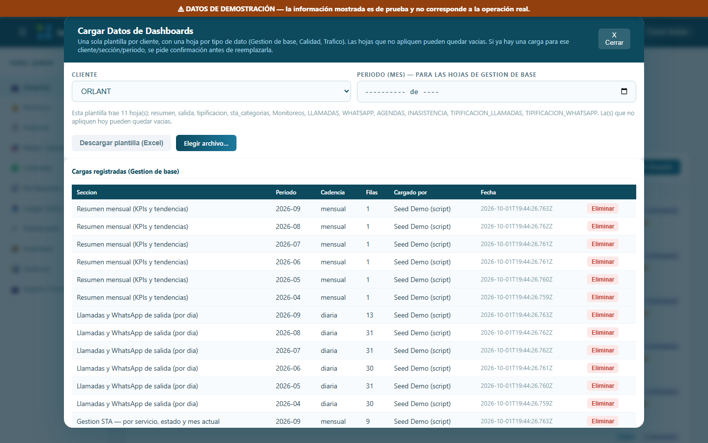
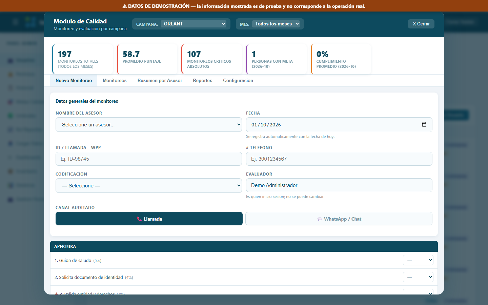
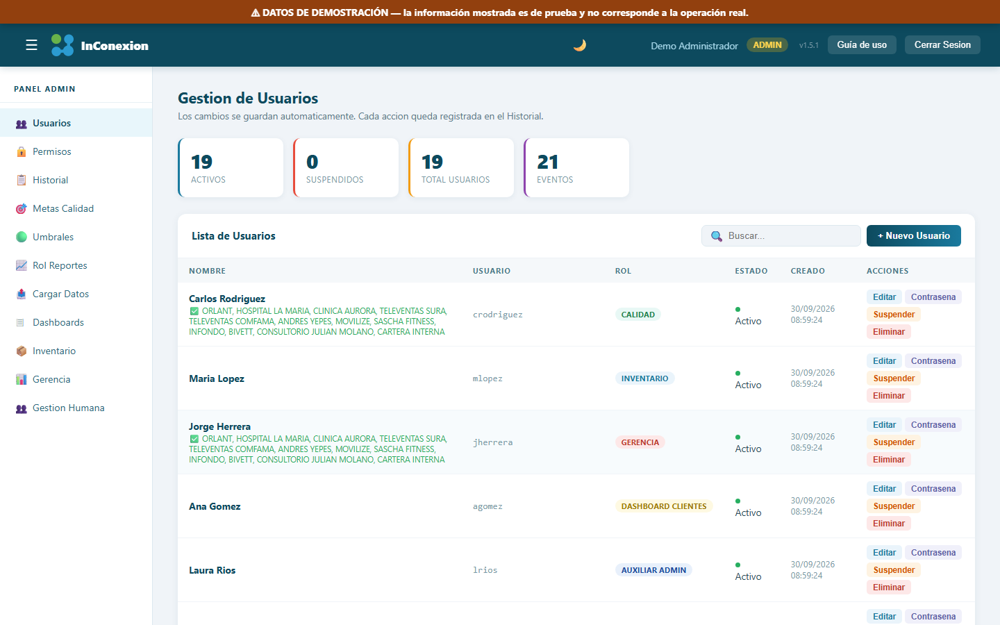

# Guía de uso — InConexión Platform (ORLANT)

Versión de la plataforma: **1.2.0**. Esta guía es para quien usa la
plataforma todos los días (Edwin, Jairo y el equipo) — no tiene nada
técnico, solo explica qué hace cada pantalla y cómo se usa.

## Índice

1. [Cómo entrar](#1-cómo-entrar)
2. [El dashboard de ORLANT](#2-el-dashboard-de-orlant)
3. [Qué significa cada indicador](#3-qué-significa-cada-indicador)
4. [Cómo cargar cada base cada mes](#4-cómo-cargar-cada-base-cada-mes)
5. [Calendario mensual](#5-calendario-mensual)
6. [Calidad](#6-calidad)
7. [Usuarios y permisos (solo administrador)](#7-usuarios-y-permisos-solo-administrador)
8. [Pendiente de datos](#8-pendiente-de-datos)
9. [A quién escribir si algo falla](#9-a-quién-escribir-si-algo-falla)

---

## 1. Cómo entrar

La plataforma vive en **https://informa.inconexion.com.co**. Ábrela en el
navegador (Chrome, Edge o similar) como cualquier página web.

En la pantalla de inicio escribe tu **usuario** y tu **contraseña**, y
presiona "Iniciar sesión". Cada persona tiene su propio usuario, con
acceso solo a lo que le corresponde (ver [sección 7](#7-usuarios-y-permisos-solo-administrador)).

**Si olvidaste la contraseña**: hoy la plataforma no tiene un botón de
"recuperar contraseña" — tienes que pedirle a un administrador que te
la cambie desde la pantalla de Usuarios (Administración → Usuarios → tu
usuario → "Cambiar contraseña"). Avísale por el canal que usen
normalmente (no la escribas en un mensaje que quede guardado, para que
solo tú la conozcas).

## 2. El dashboard de ORLANT

Al entrar, elige el dashboard de **ORLANT** en el menú principal. Arriba
del todo vas a ver:

- El **selector de MES** — elige el mes que quieres ver (ej. "Ago-26").
  Mueve las tarjetas y gráficas de todas las pestañas a ese mes a la vez.
- El botón **Exportar** — descarga a Excel todo lo que estás viendo en la
  pestaña activa (una hoja por gráfica/tabla).
- El interruptor de **tema oscuro/claro** (en el menú de tu usuario,
  arriba a la derecha) — cambia el color de toda la plataforma, no afecta
  los datos.

### Las 6 pestañas

| Pestaña | Qué muestra |
|---|---|
| **Tráfico de Llamadas** | Volumen de llamadas, nivel de servicio y estado (contestadas/abandonadas) del mes, con 5 sub-pestañas: Resumen, Abandono, AHT, ASA y ATA, Nivel de Servicio a 20s. |
| **Tráfico de WhatsApp** | Lo mismo que Llamadas, pero para los chats de WhatsApp (incluye Nivel de Servicio a 5 minutos, además del de 20 segundos). |
| **Agendamiento** | Citas agendadas, con 4 vistas: Por especialidad, Total agendas, Agendas por línea, Agendas por agente. |
| **Inasistencia** | El % de inasistencia, por mes (el total de todas las especialidades juntas) — ver el detalle en la [sección 3](#3-qué-significa-cada-indicador). |
| **Tipificación** | Cómo se clasificó cada llamada/chat (motivo de contacto). |
| **Calidad** | Monitoreo de calidad de los asesores, con su nota y resultados. |

Cada pestaña que tiene varias vistas las muestra como **sub-pestañas**
justo debajo del nombre de la pestaña principal — haz clic para cambiar
entre ellas, sin perder el mes ni los filtros que ya elegiste.

*(En este entorno de demostración no todas las bases tienen datos de
ejemplo cargados — Agendamiento y Tipificación solo aparecen cuando su
base sí está cargada, tanto en demo como en producción real.)*

### Filtros

La mayoría de las pestañas traen filtros propios arriba de sus gráficas
(especialidad, línea, rango de meses, etc.) con un botón **"Aplicar
filtros"**. Elige lo que quieras ver y presiona ese botón — las gráficas
de esa sub-pestaña se vuelven a dibujar con el filtro puesto.

Si un mes todavía no tiene datos cargados para esa pestaña, sale un aviso
explicando que no hay datos para ese mes (y un botón para ir directo al
último mes que sí tiene).

## 3. Qué significa cada indicador

**Tráfico de Llamadas**

- **Total**: todas las llamadas que entraron en el mes.
- **Contestadas**: las que un asesor sí atendió.
- **Abandonadas**: las que colgaron antes de que las atendieran.
- **Nivel de atención**: contestadas ÷ total, en %.
- **% de abandono**: abandonadas ÷ total, en %.
- **Nivel de servicio a 20 segundos**: de TODO lo que entró (no solo lo
  contestado), qué % se contestó en 20 segundos o menos. Cuando se
  combinan varias líneas o meses, se promedia **ponderado por el total de
  llamadas de cada uno** (no es un promedio simple de los porcentajes).
- **AHT** (tiempo promedio de atención): cuánto dura en promedio una
  llamada YA contestada. Se promedia ponderado por las **llamadas
  contestadas** (una llamada abandonada nunca tuvo un AHT, así que no
  cuenta en ese promedio).

**Tráfico de WhatsApp**: los mismos indicadores que Llamadas, más el
**Nivel de Servicio a 5 minutos** (mismo cálculo que el de 20 segundos,
pero con esa ventana de tiempo — es el que más le importa a WhatsApp).

**Agendamiento**: sus 4 vistas (Por especialidad, Total agendas, Agendas
por línea, Agendas por agente) muestran cuántas citas se agendaron, sin
un cálculo adicional — son conteos directos agrupados de distinta forma.

**Inasistencia**: el % de inasistencia es **(inasistencia + pendientes) ÷
total, ponderado**. Los "pendientes" (citas que quedaron sin confirmar si
la persona fue o no) cuentan como inasistencia para este cálculo; las
canceladas NO cuentan como inasistencia, pero sí quedan en el total. Al
combinar varias especialidades, el % se calcula sobre la SUMA de todas
(nunca promediando los % de cada especialidad por separado — eso daría
un número distinto y menos correcto).

**Tipificación**: conteo de cuántas llamadas/chats quedaron marcados con
cada motivo de contacto, sin cálculo adicional.

**Calidad**: cada monitoreo responde una lista de preguntas con peso
propio (SI / NO / N/A). Un SI o un N/A suma el peso completo de esa
pregunta; un NO en una pregunta normal no suma nada; un NO en una
pregunta **crítica** resta puntos adicionales y cuenta como un "fallo". El
puntaje final queda entre 0 y 100, y se clasifica así:

| Puntaje | Clasificación |
|---|---|
| Menos de 70 | 🔴 Crítico |
| 70 a 89 | 🟡 No crítico |
| 90 a 100 | 🟢 Sobresaliente |

## 4. Cómo cargar cada base cada mes

Todas las cargas se hacen desde **"Cargar Datos"** (menú principal),
eligiendo el cliente **ORLANT** y descargando primero la **plantilla
consolidada** (un solo Excel con una hoja por base). Llena la hoja que te
toque con el archivo que te llegue, sin cambiar los nombres de las
columnas, y vuelve a subir ese mismo Excel.

Al subir, la plataforma te muestra **antes de guardar** cuántas filas se
van a reemplazar (para que nunca subas un mes por error sin darte
cuenta), y después de guardar te confirma cuántas filas se cargaron.
Si algo no cuadra (falta una columna obligatoria, un dato inválido, una
fecha futura), sale un **aviso explicando exactamente qué fila y qué
columna** tiene el problema — esa fila se omite, pero el resto del
archivo sí se carga.

### Tráfico de Llamadas

- **Qué archivo**: el reporte diario de llamadas por skill, que exporta
  Wolkvox.
- **Hoja**: `LLAMADAS` de la plantilla.
- **Columnas obligatorias**: SKILL_NAME, DATE, TOTAL LLAMADAS, LLAMADAS
  CONTESTADAS. Las demás (abandonadas, niveles de servicio, ASA, ATA,
  AHT, etc.) son opcionales — si no vienen, esa gráfica queda sin ese
  dato, pero el resto carga igual.
- **Reemplazo**: al subir, se reemplazan las filas de esa(s) skill(s) en
  las fechas que trae el archivo — nunca las de otras skills o fechas que
  no vengan en el archivo.

### Tráfico de WhatsApp

- **Qué archivo**: el reporte de WhatsApp por cola, de Wolkvox.
- **Hoja**: `WHATSAPP`.
- **Columnas obligatorias**: NOMBRE_COLA_WHATSAPP, FECHA INICIO, FECHA
  FIN, TOTAL WHATSAPP, WHATSAPP CONTESTADOS. Aquí el periodo se reporta
  como un RANGO de fechas (FECHA INICIO — FECHA FIN), no un solo día.
- **Reemplazo**: mismo criterio que Llamadas, pero por el rango de fechas
  que trae cada fila.

### Tipificación

- **Qué archivo**: el reporte de tipificación de llamadas/chats de
  Wolkvox.
- **Hojas**: `TIPIFICACION_LLAMADAS` y `TIPIFICACION_WHATSAPP` (son
  independientes, se cargan por separado).
- **Columnas obligatorias**: AGENT_NAME, DATE, DESCRIPTION_COD_ACT (el
  motivo), SKILL_NAME.

### Agendas

- **Qué archivo**: el reporte de citas agendadas, del sistema de
  agendamiento de ORLANT.
- **Hoja**: `AGENDAS`.
- **Columnas obligatorias**: NOMBRE DE AGENTE, SEDE, NOMBRE_EXAMEN,
  ESPECIALIDAD, PROFESIONAL, FECHA_SOLICITUD, TIPO DE LINEA.
- **Reemplazo**: por el RANGO continuo de fechas que trae el archivo (no
  por mes) — si el archivo trae del 1 al 15, solo se reemplaza ese
  tramo.

### Inasistencia

- **Qué archivo**: el reporte mensual de inasistencia por especialidad
  que manda Edwin.
- **Hoja**: `INASISTENCIA`.
- **Columnas obligatorias**: MES, ESPECIALIDAD, CANCELADA, INASISTENCIA,
  PENDIENTE, ATENDIDAS, TOTAL.
- **Reemplazo**: por MES — si el archivo trae Agosto y Septiembre, se
  reemplazan esos 2 meses completos (todas sus especialidades), sin
  tocar ningún otro mes ya cargado.
- Septiembre (o el mes que esté en curso) puede traer menos
  especialidades que un mes ya cerrado — es normal, la plataforma avisa
  cuando eso pasa (ver [sección 3](#3-qué-significa-cada-indicador)).

### Calidad

- La carga normal es **un monitoreo a la vez**, desde el formulario (ver
  [sección 6](#6-calidad)) — no es una carga de archivo mensual como las
  demás bases.
- También existe una **carga masiva** desde Excel (3 hojas: "Monitoreos"
  para diligenciar, "Diccionario" con la lista de preguntas de
  referencia, "Resumen por Asesor" de consulta) para cuando hay muchos
  monitoreos para subir de una vez.

## 5. Calendario mensual

| Base | Quién la manda | De qué sistema sale | Cuándo se carga |
|---|---|---|---|
| Tráfico de Llamadas | Edwin | Wolkvox | Por confirmar |
| Tráfico de WhatsApp | Edwin | Wolkvox | Por confirmar |
| Tipificación | Edwin | Wolkvox | Por confirmar |
| Agendas | Edwin | Sistema de agendamiento ORLANT | Por confirmar |
| Inasistencia | Edwin | Sistema de agendamiento ORLANT | Mensual, después de cerrado el mes |
| Calidad | El equipo de Calidad | Monitoreos propios | Continuo, a medida que se hacen |

*(Las columnas "quién la manda" y "de qué sistema sale" se completan con
lo que ya sabemos hoy — las columnas "por confirmar" quedan pendientes de
que Edwin las precise.)*

## 6. Calidad

- **Crear un monitoreo**: Calidad → "Nuevo monitoreo". La fecha y el
  evaluador se ponen solos (hoy y quien inició sesión) y no se pueden
  cambiar a mano, para que el registro sea confiable. Completa el
  formulario con las respuestas (SI/NO/N/A) y guarda.

  
- **Cargar la lista de codificaciones**: Calidad → pestaña de
  configuración/catálogo — ahí se sube la lista de codificaciones válidas
  por campaña (la manda Edwin).
- **Alerta al asesor**: cuando a un asesor le registran un monitoreo
  nuevo, la próxima vez que inicia sesión le sale un aviso con un botón
  para verlo.
- **"Mis Resultados"**: cada asesor, al iniciar sesión con su propio
  usuario, tiene una pantalla donde ve sus propios monitoreos y su nota —
  no ve los de otros asesores.

## 7. Usuarios y permisos (solo administrador)

Desde **Administración → Usuarios** (solo visible si tu usuario es
administrador):

1. "Nuevo usuario" → escribe nombre, usuario, contraseña (mínimo los
   caracteres que pida el formulario) y elige el rol.
2. Marca las **campañas** a las que ese usuario va a tener acceso (ej.
   solo ORLANT) — así esa persona nunca ve datos de otra campaña.
3. Guarda. Esa persona ya puede iniciar sesión con lo que le diste.

Para cambiarle la contraseña o los permisos después, entra a ese usuario
desde la misma lista y edítalo.

## 8. Pendiente de datos

Esto no es un problema de la plataforma — son datos que todavía faltan
por llegar:

- El resumen general todavía no tiene todos los números consolidados.
- WhatsApp a 5 minutos: falta que llegue el reporte con esa columna.
- Agendas de 2026: falta la carga de datos reales de este año.
- Codificaciones de Calidad: falta la lista que va a mandar Edwin.
- Salida (llamadas/WhatsApp salientes).
- Ordenamiento médico.
- Recuperación de cancelados.

## 9. A quién escribir si algo falla

Jose David Osorio — (completar).
