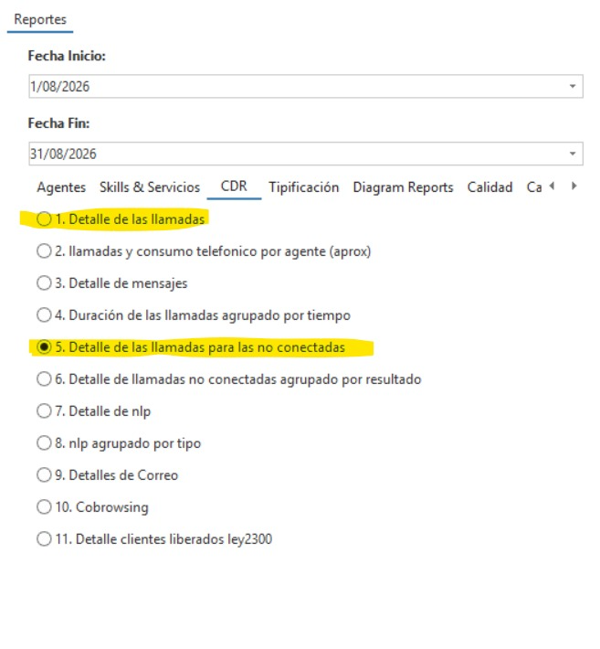

# Guía de uso — InConexion® Platform (ORLANT)

> Este archivo es el espejo legible en GitHub de la guía REAL que ve el
> usuario dentro de la plataforma: `server/paginas/guia-uso.html` (servida
> por `GET /guia-uso`, con sesión — ver `server/routes/guia.js`). Mismas 9
> secciones, mismo contenido — al editar una, editar la otra en el mismo
> PR (`scripts/guia/generar-pdf.js` regenera el PDF a partir de la versión
> HTML real, no de este `.md`).

Versión de la plataforma: **1.29.1**. Esta guía es para quien usa la
plataforma todos los días (Edwin, Jairo y el equipo) — no tiene nada
técnico, solo explica qué hace cada pantalla y cómo se usa.

> Desde octubre de 2026, la plataforma solo tiene datos oficiales de
> **agosto y septiembre de 2026** (más julio de Tipificación de WhatsApp,
> que sí es real). Los datos de meses anteriores que venían en las
> plantillas de prueba ya se quitaron.

## Índice

1. [Cómo entrar](#1-cómo-entrar)
2. [El dashboard de ORLANT](#2-el-dashboard-de-orlant)
3. [Qué significa cada indicador](#3-qué-significa-cada-indicador)
4. [Cómo cargar cada base cada mes](#4-cómo-cargar-cada-base-cada-mes)
5. [Calendario mensual](#5-calendario-mensual)
6. [Calidad](#6-calidad)
7. [Usuarios y permisos (solo administrador)](#7-usuarios-y-permisos-solo-administrador)
8. [Pendiente de datos](#8-pendiente-de-datos)
9. [A quién escribir si algo falla](#9-a-quién-escribir-si-algo-falla)

---

## 1. Cómo entrar

La plataforma vive en **https://informa.inconexion.com.co**. Ábrela en el
navegador (Chrome, Edge o similar) como cualquier página web.

En la pantalla de inicio escribe tu **usuario** y tu **contraseña**, y
presiona "Iniciar sesión". Cada persona tiene su propio usuario, con
acceso solo a lo que le corresponde (ver [sección 7](#7-usuarios-y-permisos-solo-administrador)).

**Si olvidaste la contraseña**: hoy la plataforma no tiene un botón de
"recuperar contraseña" — tienes que pedirle a un administrador que te
la cambie desde la pantalla de Usuarios (Administración → Usuarios → tu
usuario → "Cambiar contraseña"). Avísale por el canal que usen
normalmente (no la escribas en un mensaje que quede guardado, para que
solo tú la conozcas).

**Cómo cambiar mi contraseña:** si ya la sabes y quieres cambiarla tú
mismo (sin pedírselo a un administrador), entra a la plataforma y en el
menú de tu usuario (arriba a la derecha) elige **"Cambiar mi
contraseña"**. Te va a pedir la contraseña actual, la nueva y que la
confirmes. Al cambiarla, cualquier otra sesión que tuvieras abierta (otro
equipo, otra pestaña) deja de funcionar — la pantalla donde la cambiaste
sigue abierta, sin que tengas que volver a entrar.

## 2. El dashboard de ORLANT

Al entrar, elige el dashboard de **ORLANT** en el menú principal. Arriba
del todo vas a ver:

- El **selector de MES** — elige el mes que quieres ver, con su nombre
  completo (ej. "Septiembre 2026"). Mueve las tarjetas y gráficas de todas
  las pestañas a ese mes a la vez. A veces un mes aparece como **parcial**
  (ej. "Julio 2026" solo con datos de Tipificación de WhatsApp) — es normal
  y esperado cuando a ese mes solo le llegó una parte de los datos, no es
  un error.
- El botón **Exportar** — descarga a Excel todo lo que estás viendo en la
  pestaña activa (una hoja por gráfica/tabla).
- El botón de **pantalla completa** — agranda el dashboard para que ocupe
  toda la pantalla (útil al compartir pantalla en una reunión); un
  segundo clic (o la tecla Esc) vuelve a la vista normal.
- El interruptor de **tema oscuro/claro** (en el menú de tu usuario,
  arriba a la derecha) — cambia el color de toda la plataforma, no afecta
  los datos.

### Las 8 pestañas

| Pestaña | Qué muestra |
|---|---|
| **Tráfico de Llamadas** | Volumen de llamadas, nivel de servicio y estado (contestadas/abandonadas) del mes, con 5 sub-pestañas: Resumen, Abandono, AHT, ASA y ATA, Nivel de Servicio a 20s. |
| **Tráfico de WhatsApp** | Lo mismo que Llamadas, pero para los chats de WhatsApp, con 4 sub-pestañas: Resumen, Abandono, ASA y ATA, Nivel de Servicio (a 20 segundos — el de 5 minutos llega cuando Wolkvox lo entregue). No tiene sub-pestaña de AHT — Wolkvox no entrega ese dato para WhatsApp. |
| **Agendamiento** | Citas agendadas, con 4 vistas: Por especialidad, Total agendas, Agendas por línea, Ranking de asesores (por EFECTIVIDAD de agendamiento). |
| **Inasistencia** | El % de inasistencia, por mes y por especialidad, con filtros de sede/especialidad/entidad — ver el detalle en la [sección 3](#3-qué-significa-cada-indicador). |
| **Efectividad de Citas** | El % de citas agendadas que realmente se atendieron, por mes — ver el detalle en la [sección 3](#3-qué-significa-cada-indicador). |
| **Tipificación** | Cómo se clasificó cada llamada/chat (motivo de contacto). |
| **Llamadas y WhatsApp de salida** | Llamadas y WhatsApp de SALIDA (no de entrada), por mes y por línea (3P/General) — ver el detalle en la [sección 3](#3-qué-significa-cada-indicador). |
| **Calidad** | Monitoreo de calidad de los asesores, con su nota y resultados. |

Cada pestaña que tiene varias vistas las muestra como **sub-pestañas**
justo debajo del nombre de la pestaña principal — haz clic para cambiar
entre ellas, sin perder el mes ni los filtros que ya elegiste.

*(En este entorno de demostración no todas las bases tienen datos de
ejemplo cargados — Agendamiento y Tipificación solo aparecen cuando su
base sí está cargada, tanto en demo como en producción real.)*

### Filtros

La mayoría de las pestañas traen filtros propios arriba de sus gráficas
(especialidad, línea, rango de meses, etc.) con un botón **"Aplicar
filtros"**. Elige lo que quieras ver y presiona ese botón — las gráficas
de esa sub-pestaña se vuelven a dibujar con el filtro puesto.

Si un mes todavía no tiene datos cargados para esa pestaña, sale un aviso
explicando que no hay datos para ese mes (y un botón para ir directo al
último mes que sí tiene).

## 3. Qué significa cada indicador

**Tráfico de Llamadas**

- **Total**: todas las llamadas que entraron en el mes.
- **Contestadas**: las que un asesor sí atendió.
- **Abandonadas**: las que colgaron antes de que las atendieran.
- **Nivel de atención**: contestadas ÷ total, en %.
- **% de abandono**: abandonadas ÷ total, en %.
- **Nivel de servicio a 20 segundos**: de TODO lo que entró (no solo lo
  contestado), qué % se contestó en 20 segundos o menos. Cuando se
  combinan varias líneas o meses, se promedia **ponderado por el total de
  llamadas de cada uno** (no es un promedio simple de los porcentajes).
- **AHT** (tiempo promedio de atención): cuánto dura en promedio una
  llamada YA contestada. Se promedia ponderado por las **llamadas
  contestadas** (una llamada abandonada nunca tuvo un AHT, así que no
  cuenta en ese promedio).

**Tráfico de WhatsApp**: los mismos indicadores que Llamadas, con el
Nivel de Servicio a 20 segundos, **excepto el AHT**: Wolkvox no entrega
ese dato para WhatsApp, así que esa sub-pestaña no aparece. Wolkvox
tampoco entrega todavía el Nivel de Servicio a 5 minutos (la ventana de
tiempo que más le importa a WhatsApp) — cuando llegue ese dato, se puede
activar sin tocar nada más de la plataforma.

**Agendamiento**: "Por especialidad", "Total agendas" y "Agendas por
línea" muestran cuántas citas se agendaron, sin un cálculo adicional —
son conteos directos agrupados de distinta forma. La 4ª vista, **Ranking
de asesores**, es distinta: ordena a los asesores por **% de EFECTIVIDAD
de agendamiento = agendas ÷ gestiones** (nunca por cantidad de agendas) —
un asesor con pocas gestiones pero casi todas agendadas puede quedar por
encima de uno con muchas más gestiones pero menos agendadas. La
tarjeta "Efectividad del equipo" es la **suma de todas las agendas ÷ suma
de todas las gestiones** (ponderada) — nunca el promedio simple de los %
de cada asesor, que da un número distinto (y menos correcto, porque le da
el mismo peso a un asesor con 50 gestiones que a uno con 2.000).

Tanto la tabla de **Agendas** como el **Ranking de Efectividad de
Agendamiento** muestran el **nombre real del asesor** — lo ve cualquier
usuario con acceso al dashboard de ORLANT (ver [sección 7](#7-usuarios-y-permisos-solo-administrador)
para quién tiene acceso a qué). Es normal ver algún asesor por encima del
100% de efectividad (agenda más de lo que cuentan sus gestiones
registradas) — no es un error de carga; queda pendiente aclarar si hay
agendas que se originan por fuera de las gestiones que se están
contando.

**Inasistencia**: el % de inasistencia es **(inasistencia + pendientes) ÷
total, ponderado**. Los "pendientes" (citas que quedaron sin confirmar si
la persona fue o no) cuentan como inasistencia para este cálculo; las
canceladas NO cuentan como inasistencia, pero sí quedan en el total. Al
combinar varias especialidades, el % se calcula sobre la SUMA de todas
(nunca promediando los % de cada especialidad por separado — eso daría
un número distinto y menos correcto). Tiene filtros de Sede, Especialidad
y Entidad (esta última con buscador, porque son muchas) y 2 vistas:

- **Resumen por mes** (la que abre por defecto): 2 tarjetas (el % de todo
  el período que deja pasar los filtros de arriba, y el % del mes elegido
  arriba — cada una dice su propio rango, para no confundirlas) más una
  gráfica de línea con el valor de cada mes, una tabla de datos debajo
  (mes y % alineados, más el total de citas) y un aviso cuando un mes
  trae menos datos que el resto — el mes elegido arriba se resalta (punto
  más grande, columna en negrita en la tabla); un mes que todavía viene
  del formato de reporte anterior (sin sede ni entidad) se marca con un
  punto hueco, el último tramo de la línea punteado y un asterisco en la
  tabla.
- **Por especialidad**: una barra por especialidad, del mes elegido
  arriba. Las especialidades con muy pocas citas ese mes se marcan con
  un asterisco (\*) y se muestran al final — su % puede no ser
  representativo.

**Efectividad de Citas**: el % de **EFECTIVIDAD = citas atendidas ÷
agendas**, un total del mes (no por especialidad ni asesor). Muestra 2
tarjetas: el % del mes elegido arriba, y el % **ponderado** de todo el
período que tiene datos cargados (suma de atendidas ÷ suma de agendas de
esos meses — nunca el promedio simple de los % de cada mes), con el rango
de meses en su etiqueta. Hoy esta pestaña tiene Agosto y Septiembre 2026
— igual que el resto de la plataforma, solo los meses oficiales.

**Llamadas y WhatsApp de salida**: el total del mes de llamadas y WhatsApp de **salida** (que la
campaña hace hacia afuera, no las que recibe), separado por línea 3P y
Línea General. Muestra 2 tarjetas (total de llamadas y total de WhatsApp
del mes elegido, con la variación contra el mes anterior cuando hay con
qué comparar) y 2 gráficas de barras (una para llamadas, otra para
WhatsApp) — con pocos meses de historia, una gráfica de barras por mes se
lee mejor que una línea de tendencia. La tabla de abajo también muestra
qué porcentaje de cada mes fue 3P vs. Línea General (participación DENTRO
de ese mismo mes — no hay todavía un indicador de salida contra el total
de gestión, por eso no aparece aquí).

**Tipificación**: conteo de cuántas llamadas/chats quedaron marcados con
cada motivo de contacto, sin cálculo adicional. El nombre del asesor
también aparece aquí (ya era así desde antes).

**Calidad**: cada monitoreo responde una lista de preguntas con peso
propio (SI / NO / N/A). Un SI o un N/A suma el peso completo de esa
pregunta; un NO en una pregunta normal no suma nada; un NO en una
pregunta **crítica** resta puntos adicionales y cuenta como un "fallo". El
puntaje final queda entre 0 y 100, y se clasifica así:

| Puntaje | Clasificación |
|---|---|
| Menos de 70 | 🔴 Crítico |
| 70 a 89 | 🟡 No crítico |
| 90 a 100 | 🟢 Sobresaliente |

## 4. Cómo cargar cada base cada mes

Todas las cargas se hacen desde **"Cargar Datos"** (menú principal),
eligiendo el cliente **ORLANT** y descargando primero la **plantilla
consolidada** (un solo Excel con una hoja por base). Llena la hoja que te
toque con el archivo que te llegue, sin cambiar los nombres de las
columnas, y vuelve a subir ese mismo Excel.

Al subir, la plataforma te muestra **antes de guardar** cuántas filas se
van a reemplazar (para que nunca subas un mes por error sin darte
cuenta), y después de guardar te confirma cuántas filas se cargaron.
Si algo no cuadra (falta una columna obligatoria, un dato inválido, una
fecha futura), sale un **aviso explicando exactamente qué fila y qué
columna** tiene el problema — esa fila se omite, pero el resto del
archivo sí se carga.

### Tráfico de Llamadas

- **Qué archivo**: el reporte diario de llamadas por skill, que exporta
  Wolkvox.
- **Hoja**: `LLAMADAS` de la plantilla.
- **Columnas obligatorias**: SKILL_NAME, DATE, TOTAL LLAMADAS, LLAMADAS
  CONTESTADAS. Las demás (abandonadas, niveles de servicio, ASA, ATA,
  AHT, etc.) son opcionales — si no vienen, esa gráfica queda sin ese
  dato, pero el resto carga igual.
- **Reemplazo**: al subir, se reemplazan las filas de esa(s) skill(s) en
  las fechas que trae el archivo — nunca las de otras skills o fechas que
  no vengan en el archivo.

### Tráfico de WhatsApp

- **Qué archivo**: el reporte de WhatsApp por cola, de Wolkvox.
- **Hoja**: `WHATSAPP`.
- **Columnas obligatorias**: NOMBRE_COLA_WHATSAPP, FECHA INICIO, FECHA
  FIN, TOTAL WHATSAPP, WHATSAPP CONTESTADOS. Aquí el periodo se reporta
  como un RANGO de fechas (FECHA INICIO — FECHA FIN), no un solo día.
- **Reemplazo**: mismo criterio que Llamadas, pero por el rango de fechas
  que trae cada fila.

### Tipificación

- **Qué archivo**: el reporte de tipificación de llamadas/chats de
  Wolkvox. Llamadas y WhatsApp son independientes, se cargan por separado
  (cada una reemplaza solo su propio canal, nunca el otro).
- **Llamadas** — hoja `TIPIFICACION_LLAMADAS`, columnas obligatorias
  AGENT_NAME, DATE, DESCRIPTION_COD_ACT (el motivo), SKILL_NAME.
- **WhatsApp** — el archivo real es el export **"HistChat"** de Wolkvox.
  La hoja de ese export **cambia de nombre cada vez que se genera** (ej.
  "HistChat2026-09-30-14h32") — **no hace falta renombrarla**, la
  plataforma la reconoce igual por sus columnas (no por el nombre de la
  hoja). Ese archivo trae columnas con datos de contacto del paciente
  (nombre, correo, teléfono, comentarios de la conversación): la
  plataforma **nunca las lee ni las guarda** — solo toma el asesor, la
  fecha y el motivo de contacto (código de tipificación).
- **Límite de tamaño por carga**: una carga mensual normal cabe sin
  problema; si el archivo junta muchos meses de una sola vez y es muy
  grande, la plataforma avisa ANTES de intentar guardar nada — en ese
  caso, sube el archivo por meses, uno a la vez.

### Agendas

- **Qué archivo**: el reporte de citas agendadas, del sistema de
  agendamiento de ORLANT.
- **Hoja**: `AGENDAS`.
- **Columnas obligatorias**: NOMBRE DE AGENTE, SEDE, NOMBRE_EXAMEN,
  ESPECIALIDAD, PROFESIONAL, FECHA_SOLICITUD, TIPO DE LINEA.
- **Reemplazo**: por el RANGO continuo de fechas que trae el archivo (no
  por mes) — si el archivo trae del 1 al 15, solo se reemplaza ese
  tramo.
- **Límite de tamaño por carga**: igual que Tipificación — una carga
  mensual normal cabe sin problema; si el archivo junta varios meses de
  una sola vez y es muy grande, la plataforma avisa ANTES de intentar
  guardar nada. Sube el archivo por meses, uno a la vez.

### Alias de nombre de asesor

Cuando el mismo asesor queda escrito de 2 formas distintas en los
archivos (ej. con y sin tilde, o con un apellido distinto) en Agendas,
Efectividad de Agendamiento o Tipificación, la plataforma puede
**unificarlos bajo un solo nombre** para que el Ranking y los reportes no
los cuenten como 2 personas diferentes — eso es un "alias". Hoy esto
todavía no tiene una pantalla propia (solo lo puede crear o borrar un
administrador); si ves un asesor duplicado en el Ranking, avísale a InCo
para que agregue el alias. **Importante**: borrar un alias NO separa de
nuevo los datos que ya quedaron unificados — esos registros ya guardados
siguen contando como una sola persona para siempre; borrar el alias solo
evita que las cargas futuras se unifiquen de la misma forma.

### Efectividad de Agendamiento (Ranking de asesores)

- **Qué archivo**: el resumen mensual de gestiones/agendas por asesor, de
  Edwin — una fila por asesor, no por cita.
- **Hoja**: `EFECTIVIDAD_AGENDAMIENTO`.
- **Columnas obligatorias**: NOMBRE DE AGENTE, MES, CANTIDAD DE
  GESTIONES, AGENDAS. La columna EFECTIVIDAD del archivo (si viene) nunca
  se guarda — la plataforma siempre la vuelve a calcular; si el número
  del archivo no coincide con el recalculado, sale una advertencia en la
  confirmación (no bloquea la carga).
- **Reemplazo**: por MES — si el archivo trae Septiembre, se reemplaza
  ese mes completo para todos los asesores que traiga, sin tocar otros
  meses ya cargados.

### Inasistencia

- **Qué archivo**: el export de citas del sistema de agendamiento de
  Edwin — una fila por CITA (no un resumen), puede traer varios meses a
  la vez.
- **Hoja**: `INASISTENCIA`.
- **Columnas obligatorias**: SEDE, ESPECIALIDAD, FECHA_CITA, NOMBRE
  ENTIDAD, CITEST.
- **CITEST**: una letra por cita — `C` = Cancelada, `I` = Inasistencia,
  `P` = Pendiente (sin confirmar si la persona fue o no), `T` =
  Atendida. Una letra distinta de estas 4 (o vacía) se avisa; si son
  demasiadas filas así, la carga se rechaza completa.
- El sistema agrupa las filas por sede/especialidad/entidad/mes en el
  navegador antes de guardar — no borres ni resumas filas repetidas: sin
  un número de cita, dos filas idénticas son dos citas reales.
- **Privacidad**: cualquier entidad (NOMBRE ENTIDAD) que aparezca muy
  pocas veces en el archivo se guarda como "PARTICULAR / OTRA" — nunca
  se muestra ni se guarda el valor original.
- **Reemplazo**: por MES — si el archivo trae Agosto y Septiembre, se
  reemplazan esos 2 meses completos, sin tocar ningún otro mes ya
  cargado.
- Septiembre (o el mes que esté en curso) puede traer menos
  especialidades que un mes ya cerrado — es normal, la plataforma avisa
  cuando eso pasa (ver [sección 3](#3-qué-significa-cada-indicador)).

### Efectividad de Citas Atendidas

- **Qué archivo**: el total mensual de agendas/atendidas de Edwin — un
  total del mes, no una fila por cita ni por asesor.
- **Hoja**: `CITAS_ATENDIDAS`.
- **Columnas obligatorias**: MES, AGENDAS, ATENDIDAS. La columna
  EFECTIVIDAD CITAS ATENDIDAS del archivo (si viene) nunca se guarda —
  siempre se recalcula.
- **Reemplazo**: por MES — si el archivo trae Enero, Febrero y Marzo, se
  reemplazan esos 3 meses completos, sin tocar ningún otro mes ya
  cargado.

### Llamadas y WhatsApp de salida

- **Qué archivo**: el consolidado mensual de llamadas y WhatsApp de
  SALIDA de Edwin — un total del mes, no una fila por llamada/chat.
- **Hoja**: cualquier nombre (la plataforma la reconoce por sus
  columnas) — el archivo real de Edwin trae una sola hoja llamada
  "Hoja1", con el encabezado en la fila 3 (2 filas vacías antes).
- **Columnas obligatorias**: MES, LINEA 3P, LINEA GENERAL, WHATSAPP 3P,
  WHATSAPP GENERAL.
- **El mes no trae año** (igual que Efectividad de Agendamiento/Citas):
  antes de guardar, la plataforma muestra a qué año resolvió cada mes
  (ej. "AGOSTO → Agosto 2026") y pregunta si es correcto — si no lo es,
  pide el año correcto y vuelve a intentarlo. Nunca lo adivina en
  silencio.
- **Reemplazo**: por MES — si el archivo trae Agosto y Septiembre, se
  reemplazan esos 2 meses completos, sin tocar ningún otro mes ya
  cargado.

### Calidad

- La carga normal es **un monitoreo a la vez**, desde el formulario (ver
  [sección 6](#6-calidad)) — no es una carga de archivo mensual como las
  demás bases.
- También existe una **carga masiva** desde Excel (3 hojas: "Monitoreos"
  para diligenciar, "Diccionario" con la lista de preguntas de
  referencia, "Resumen por Asesor" de consulta) para cuando hay muchos
  monitoreos para subir de una vez.

### Llamadas Únicas (Mobilize)

- **Qué archivo**: el mismo patrón que las demás bases de Wolkvox, pero
  este archivo hay que armarlo a mano combinando 3 reportes distintos de
  Wolkvox (ver más abajo cómo sacarlos) — Edwin es quien hace esa
  combinación antes de subir.
- **Hoja**: `LLAMADAS_UNICAS` de la plantilla oficial
  (`PLANTILLA_LLAMADAS_UNICAS_MOBILIZE.xlsx`, descargable desde "Cargar
  Datos" eligiendo el cliente **Mobilize**).
- **Columnas obligatorias**: AGENT_NAME, DATE, TELEPHONE, SKILL_NAME. Las
  filas de llamadas **abandonadas** van con `SKILL_NAME = NO CONTESTADAS`.
- **Privacidad**: TELEPHONE se usa solo un instante, en la computadora de
  quien sube el archivo, para no contar dos veces una misma llamada del
  mismo número el mismo día — nunca llega al servidor, nunca se guarda,
  nunca se exporta ni se muestra en ninguna pantalla.
- **Reemplazo**: por MES — si el archivo trae Septiembre, se reemplaza
  ese mes completo.

**Cómo sacar las llamadas únicas desde Wolkvox, paso a paso:**

1. **Contestadas de ingreso**: en Wolkvox, Reportes → pestaña **CDR** →
   reporte **"1. Detalle de las llamadas"**. De ahí se quitan dos cosas
   antes de pegarlas en la plantilla: las llamadas de **salida** (el
   número de teléfono trae un guion) y los **duplicados del mismo número
   el mismo día** (no de todo el mes — si el mismo número llama dos días
   distintos, cuenta en cada uno).
2. **Abandonadas**: en Wolkvox, **Skills & Servicios** → reporte **"2.
   Llamadas abandonadas"**, filtrando por skill. Esas filas van a la
   plantilla con `SKILL_NAME = NO CONTESTADAS`.
3. **Salientes no conectadas**: en Wolkvox, Reportes → pestaña **CDR** →
   reporte **"5. Detalle de las llamadas para las no conectadas"** (esta
   parte todavía no se carga en la plataforma — queda para cuando Edwin
   mande ese archivo aparte).

## 5. Calendario mensual

| Base | Quién la manda | De qué sistema sale | Cuándo se carga |
|---|---|---|---|
| Tráfico de Llamadas | Edwin | Wolkvox | **Pendiente de confirmar con Edwin** |
| Tráfico de WhatsApp | Edwin | Wolkvox | **Pendiente de confirmar con Edwin** |
| Tipificación | Edwin | Wolkvox | **Pendiente de confirmar con Edwin** |
| Agendas | Edwin | Sistema de agendamiento ORLANT | **Pendiente de confirmar con Edwin** |
| Efectividad de Agendamiento | Edwin | Resumen propio de ORLANT | Mensual, después de cerrado el mes |
| Inasistencia | Edwin | Sistema de agendamiento ORLANT | Mensual, después de cerrado el mes |
| Efectividad de Citas Atendidas | Edwin | Resumen propio de ORLANT | Mensual, después de cerrado el mes |
| Llamadas y WhatsApp de salida | Edwin | Resumen propio de ORLANT | Mensual, después de cerrado el mes |
| Calidad | El equipo de Calidad | Monitoreos propios | Continuo, a medida que se hacen |

*(Las filas en negrita son las que todavía no tienen una frecuencia
confirmada — quedan pendientes de que Edwin la precise; el resto ya se
confirmó con él.)*

## 6. Calidad

- **Crear un monitoreo**: Calidad → "Nuevo monitoreo". La fecha y el
  evaluador se ponen solos (hoy y quien inició sesión) y no se pueden
  cambiar a mano, para que el registro sea confiable. Completa el
  formulario con las respuestas (SI/NO/N/A) y guarda.

  
- **Cargar la lista de codificaciones**: Calidad → pestaña de
  configuración/catálogo — ahí se sube la lista de codificaciones válidas
  por campaña (la manda Edwin).
- **Alerta al asesor**: cuando a un asesor le registran un monitoreo
  nuevo, la próxima vez que inicia sesión le sale un aviso con un botón
  para verlo.
- **"Mis Resultados"**: cada asesor, al iniciar sesión con su propio
  usuario, tiene una pantalla donde ve sus propios monitoreos y su nota —
  no ve los de otros asesores.

## 7. Usuarios y permisos (solo administrador)

Desde **Administración → Usuarios** (solo visible si tu usuario es
administrador):

1. "Nuevo usuario" → escribe nombre, usuario, contraseña (mínimo los
   caracteres que pida el formulario) y elige el rol.
2. Marca las **campañas** a las que ese usuario va a tener acceso (ej.
   solo ORLANT) — así esa persona nunca ve datos de otra campaña.
3. Guarda. Esa persona ya puede iniciar sesión con lo que le diste.

Para cambiarle la contraseña o los permisos después, entra a ese usuario
desde la misma lista y edítalo.

## 8. Pendiente de datos

Esto no es un problema de la plataforma — son datos que todavía faltan
por llegar:

- **Nivel de servicio de WhatsApp a 5 minutos**: falta que el reporte de
  Wolkvox traiga esa columna.
- **Ordenamiento Médico, Recuperación de Cancelados, Flujo Mensual,
  Gestión STA**: las pantallas ya están construidas, quedan ocultas
  hasta que llegue el archivo real de cada una.

## 9. A quién escribir si algo falla

Jose David Osorio — (completar).
